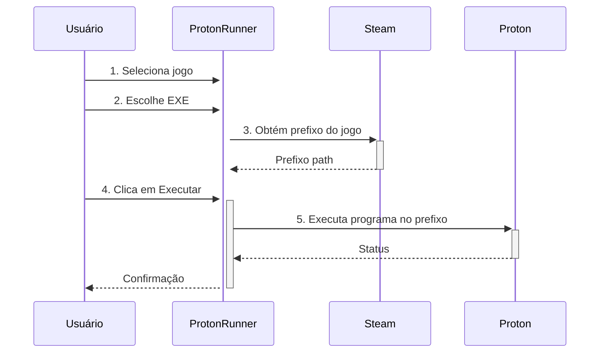
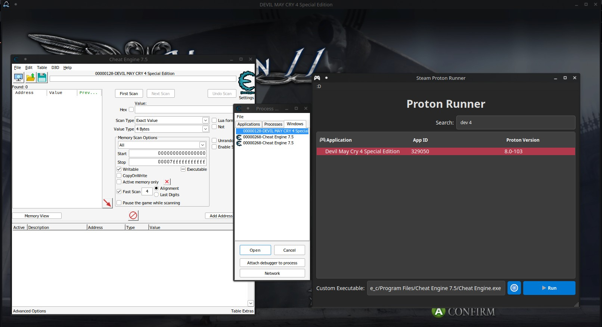
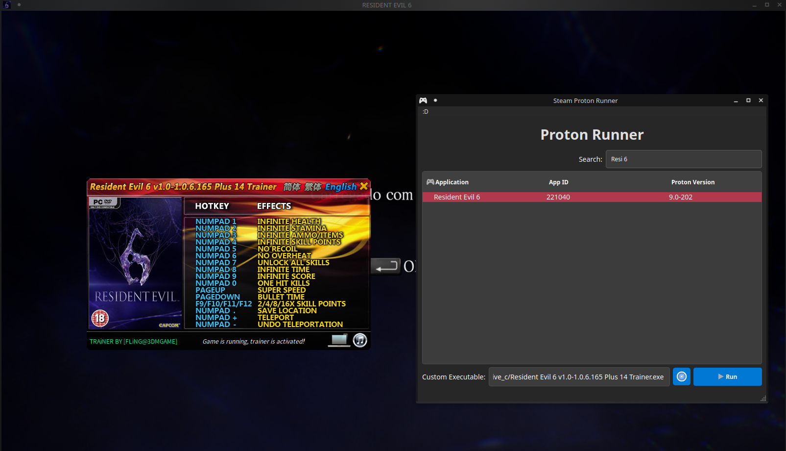

# 🎮Proton Prefix Runner 🧩▶️

  

**Ferramenta para executar programas Windows no mesmo prefixo Proton de jogos Steam**

  
  

## ✨ Funcionalidades Principais

  

- 🔄 Injeta executáveis Windows no prefixo Proton de jogos Steam

- 🎮 Compatível com:

- Cheat Engine

- Mod Loaders (como UnityModManager)

- Trainers e programas

- Ferramentas de depuração

- 📁 Gerencia múltiplos prefixos Proton automaticamente

- 🔍 Busca inteligente por jogos instalados

  

## 🛠️ Tecnologias Utilizadas

  

```text

Qt 6 (C++) - Interface gráfica

Proton (Valve/GE) - Compatibilidade Windows

Steam Runtime - Integração com a Steam

```

  

## 📦 Instalação

  

### Pré-requisitos

- Steam instalado

- Pelo menos um jogo com Proton 8 ou superior

- Qt 6

  

```bash

# Linux

git  clone  https://github.com/SrShadowy/ProtonRunner.git

cd  ProtonRunner

qmake && make

```

  

## 🚀 Como Usar

  

1.  **Selecione um jogo** na lista (automaticamente detectados)

2.  **Escolha o executável** (ex: CheatEngine.exe)

3.  **Execute** no mesmo prefixo do jogo

  



  

## 🧩 Casos de Uso




### 1. Usando Cheat Engine

```bash

1.  Selecione  "Devil May Cry HD Colletion" (AppID 631510)

2.  Localize o "CheatEngine-x86_64.exe"

3.  Clique  em  "Run"  -  Agora  o  CE  verá  o  processo  do  jogo!

```

  
  

## ❓ FAQ

  

**P:** Por que meu programa não vê o jogo?

**R:** Verifique se estão no mesmo prefixo (use `PROTON_LOG=1` para debug).

  

## 📜 Licença

  

MIT License - Veja [LICENSE](LICENSE) para detalhes.

  

---

 
*"Porque as vezes você precisa de tudo no mesmo lugar"* 😉
